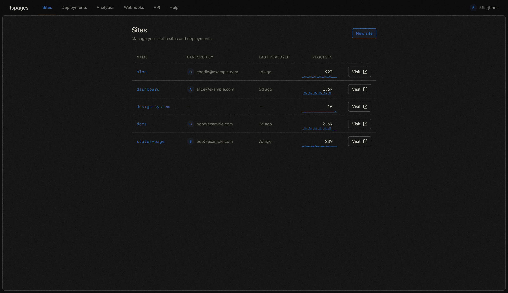

# tspages

> A lightweight static site hosting platform for your Tailscale network.

Have you ever wanted to host internal documentation, dashboards, or demos for your team without the hassle of setting up
and maintaining a full server, or exposing sensitive content on the public internet? tspages is a simple, secure
solution for hosting static sites directly on your tailnet.
Each site gets its own tsnet hostname, served over HTTPS with automatic TLS, and access is controlled via Tailscale
Application Grants—no shared secrets, no separate auth layer.

Features include:

- **Easy deployment**: Upload a ZIP or tarball of your static site, or even a single Markdown file, and it's live
  immediately.
- **Admin dashboard**: View all your sites, deployments, and analytics in one place. Activate or roll back deployments
  with a click. Drop a folder onto the dashboard to deploy right away.
- **Fine-grained access control**: Use Tailscale's existing ACL system to control who can view or deploy to each site,
  down to the individual user or group level.
- **Per-site configuration**: Customize 404 pages, headers, redirects, and SPA routing on a per-deployment basis with
  an optional `tspages.toml` included in your upload.
- **Built-in analytics**: See request counts, top pages, visitor info, and more for each site.

## Quick Start

### Prerequisites

You need a **reusable auth key** tagged with `tag:pages` (or any tag you choose). Create one in the
[Tailscale admin console](https://login.tailscale.com/admin/settings/keys) under Settings > Keys > Generate auth key.
Make sure **Reusable** is checked, since tspages registers multiple devices with the same key.

### 1. Add a tailnet grant

In the Tailscale admin console, go to Access Controls and add a grant so tailnet members can use tspages:

```json
{
  "grants": [
    {
      "src": [
        "autogroup:member"
      ],
      "dst": [
        "tag:pages"
      ],
      "ip": [
        "443"
      ],
      "app": {
        "tspages.mazetti.me/cap/pages": [
          {
            "access": "admin"
          }
        ]
      }
    }
  ]
}
```

> Start with `admin` access to set things up. You can narrow permissions later -- see
> [Authorization](internal/admin/docs/authorization.md) for fine-grained examples.

### 2. Run tspages

#### Docker (recommended)

```bash
docker run -d \
  -v tspages-state:/state \
  -v tspages-data:/data \
  -e TS_AUTHKEY=tskey-auth-... \
  ghcr.io/radiergummi/tspages:latest
```

That's it. The default configuration works out of the box -- state is stored in `/state`, site data in `/data`.

#### Binary

Download the latest release from [GitHub](https://github.com/Radiergummi/tspages/releases/latest), then run:

```bash
TS_AUTHKEY=tskey-auth-... ./tspages
```

This uses `./state` and `./data` in the current directory. See
[Configuration](internal/admin/docs/configuration.md) for all options.

### 3. Deploy a site

```bash
tspages deploy your-site/dist my-site
```

Or with curl:

```bash
cd your-site/dist
zip -r ../site.zip .
curl -sf --upload-file ../site.zip \
  https://pages.your-tailnet.ts.net/deploy/my-site
```

Your site is live at `https://my-site.your-tailnet.ts.net/`. Open `https://pages.your-tailnet.ts.net/sites` to see
the admin dashboard.

## Admin Dashboard

Every tspages instance includes a built-in admin panel at the control plane hostname. Admins get a full overview of all
sites, deployments, and traffic -- deployers see only the sites they have access to.

### Sites overview

The main view lists all sites with their last deploy info and a request sparkline.



Drill into a site to see its deployment history, activate or roll back deployments, and manage the site.


### Deployment feed

A global, paginated feed of all deployments across all sites.


Each deployment shows a file listing and a diff against the previous deployment (added, removed, and changed files).


### Analytics

Cross-site and per-site analytics with request counts, top pages, visitors, and device breakdowns.


### Webhooks

Configure webhooks to get notified of new deployments, site changes, or other events. Webhooks can be set globally or
per-site, and support custom payloads with deployment details.


Monitor webhook deliveries with a history of recent attempts, including request and response details for debugging.


### API

The admin dashboard exposes a REST API for all operations, and provides an OpenAPI spec for easy integration.


## Architecture

```
pages.your-tailnet.ts.net     → control plane: POST /deploy/{site}, GET /sites
docs.your-tailnet.ts.net      → serves docs site at /
demo.your-tailnet.ts.net      → serves demo site at /
```

Each deployed site gets its own tsnet hostname. The `pages` hostname serves as the control plane for deploy and admin
APIs.

## Documentation

Full documentation is available in the [`docs/`](internal/admin/docs/) directory and in the admin dashboard under Help.

| Topic                                                            | Description                                         |
|------------------------------------------------------------------|-----------------------------------------------------|
| [Getting Started](internal/admin/docs/getting-started.md)        | Prerequisites, installation, first deployment       |
| [CLI Deploy](internal/admin/docs/cli-deploy.md)                  | Deploying from the command line                     |
| [Upload Formats](internal/admin/docs/upload-formats.md)          | ZIP, tar, Markdown, and other supported formats     |
| [Per-Site Configuration](internal/admin/docs/per-site-config.md) | `tspages.toml` fields, headers, redirects, SPA mode |
| [Authorization](internal/admin/docs/authorization.md)            | Access levels, capability schema, grant examples    |
| [API Reference](internal/admin/docs/api.md)                      | All HTTP endpoints                                  |
| [Analytics](internal/admin/docs/analytics.md)                    | Viewing, disabling, and purging analytics           |
| [GitHub Actions](internal/admin/docs/github-actions.md)          | CI/CD deployment workflow                           |
| [Configuration](internal/admin/docs/configuration.md)            | Full config reference, env vars, Docker, local dev  |

## Local Development

To work on the admin frontend with hot reloading:

```bash
# Terminal 1: Vite dev server
npx vite

# Terminal 2: Go server with dev mode
go run ./cmd/tspages -dev
```

Open http://localhost:8080 in your browser. The `-dev` flag:

- Serves CSS/JS from the Vite dev server with hot module replacement
- Re-parses Go templates from disk on every request (refresh to see changes)
- Provides a localhost listener with mock admin auth (no Tailscale required to browse the UI)

The tsnet control plane still starts normally alongside the dev server. Production builds use `npx vite build`, which
outputs to `internal/admin/assets/dist/` (embedded at compile time).

## Security

- **Archive extraction** rejects path traversal (zip-slip and tar equivalents), symlinks, hardlinks, and enforces size
  limits on both compressed and decompressed content
- **Site names** must be valid DNS labels (lowercase alphanumeric and hyphens, max 63 characters)
- **Auth** uses the local Tailscale daemon's WhoIs -- identity is verified by Tailscale, not forgeable by the remote
  peer
- **Deployments** are atomic: files are fully written before the `current` symlink is swapped
- **State directory** (`state_dir`) should be `0700` -- it contains the node key and certificates
